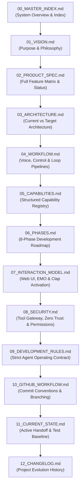

# 🧭 Captain AI OS 2.0 — Master Knowledge & Continuity Index

> **Repository Root:** `D:\captain`  
> **GitHub:** [adil1378/captain-AI-assistant](https://github.com/adil1378/captain-AI-assistant)  
> **Current Git Baseline:** `bdfaf69`  
> **System Classification:** Windows-Native Autonomous AI Desktop Companion  
> **Authoritative Knowledge Base:** `D:\captain\captain_docs\`

---

## 🚨 AGENT START HERE

If you are an AI assistant (Antigravity, Codex, Claude Code, etc.) or a human engineer taking over this repository:

1. **DO NOT START CODING IMMEDIATELY.**
2. **DO NOT BUILD FROM SCRATCH.** Captain is an existing project with established Phase 1 and Phase 2 architectures.
3. **DO NOT INVENT NEW FEATURES OR EXPAND SCOPE.** Your work must strictly conform to the user's explicit command.
4. **READ THIS INDEX FIRST**, then inspect [`11_CURRENT_STATE.md`](file:///d:/captain/captain_docs/11_CURRENT_STATE.md) to understand exactly where the project stands right now.
5. **CONSULT SPECIFIC DOCUMENTS** relevant to your assigned task before modifying any files.

---

## 1. What is Captain AI OS 2.0?

**Captain AI OS 2.0** is a persistent, Windows-native autonomous AI desktop companion. 

It is designed to remain permanently available on the Windows desktop, accept natural voice instructions (with keyboard fallback), observe the screen, reason about application state, autonomously operate the computer (launching applications, typing, clicking, running terminal commands, and editing code), verify the outcomes of its actions, and report back to the user through synthesized voice and an animated 3D companion avatar (**EMO**).

Captain operates on a continuous autonomous control loop:
$$\text{Observe} \longrightarrow \text{Reason} \longrightarrow \text{Plan} \longrightarrow \text{Act} \longrightarrow \text{Observe Again} \longrightarrow \text{Verify} \longrightarrow \text{Report / Standby}$$

---

## 2. Master Reading Order

To understand the system completely, read the documentation in the following sequence:

> **Task-Scoped Reading:** When performing a narrowly defined task, you do not need to read every file. First read `00_MASTER_INDEX.md` and `11_CURRENT_STATE.md`, then consult only the specific documents related to your task (e.g. `08_SECURITY.md` for tool permissions, `07_INTERACTION_MODEL.md` for EMO/Clap behavior).

---

## 3. Documentation System Directory Map

All authoritative project documentation is located strictly within `D:\captain\captain_docs\`:

| Document | Purpose & Scope | When to Read |
| :--- | :--- | :--- |
| [`00_MASTER_INDEX.md`](file:///d:/captain/captain_docs/00_MASTER_INDEX.md) | Central entry point, reading order, and document map. | First file to read on any session. |
| [`01_VISION.md`](file:///d:/captain/captain_docs/01_VISION.md) | Core vision, non-goals, and long-term user experience. | When aligning on product identity. |
| [`02_PRODUCT_SPEC.md`](file:///d:/captain/captain_docs/02_PRODUCT_SPEC.md) | Full specification of capabilities with real implementation status. | When verifying capability boundaries. |
| [`03_ARCHITECTURE.md`](file:///d:/captain/captain_docs/03_ARCHITECTURE.md) | Deep breakdown of Current vs Target architecture and directory roles. | Before modifying runtime, agents, or tools. |
| [`04_WORKFLOW.md`](file:///d:/captain/captain_docs/04_WORKFLOW.md) | Execution pipelines (Voice, Keyboard, Computer-Use, Development). | When tracing end-to-end data/control flow. |
| [`05_CAPABILITIES.md`](file:///d:/captain/captain_docs/05_CAPABILITIES.md) | Registry of all capabilities with inputs, outputs, and security tiers. | Before adding or modifying tools/agents. |
| [`06_PHASES.md`](file:///d:/captain/captain_docs/06_PHASES.md) | The 8-phase development roadmap, exit criteria, and boundaries. | When planning or verifying phase milestones. |
| [`07_INTERACTION_MODEL.md`](file:///d:/captain/captain_docs/07_INTERACTION_MODEL.md) | Two-interface architecture (Web + Desktop EMO) and Clap activation. | When modifying UI, Audio, or Pet visuals. |
| [`08_SECURITY.md`](file:///d:/captain/captain_docs/08_SECURITY.md) | Tool invocation layer, permission checks, dialogs, and zero-trust. | Before executing any OS/external tool. |
| [`09_DEVELOPMENT_RULES.md`](file:///d:/captain/captain_docs/09_DEVELOPMENT_RULES.md) | Strict 20-rule agent contract, scope boundaries, and stop-gates. | **Mandatory before writing any code.** |
| [`10_GITHUB_WORKFLOW.md`](file:///d:/captain/captain_docs/10_GITHUB_WORKFLOW.md) | Commit conventions, phase release requirements, and git standards. | Before staging, committing, or pushing code. |
| [`11_CURRENT_STATE.md`](file:///d:/captain/captain_docs/11_CURRENT_STATE.md) | The active continuity file (Git baseline, test status, next action). | **Mandatory at the start of every turn.** |
| [`12_CHANGELOG.md`](file:///d:/captain/captain_docs/12_CHANGELOG.md) | Project-level milestone and architectural evolution history. | To review past changes or record phase gates. |
| [`PHASE_1_REPORT.md`](file:///d:/captain/captain_docs/PHASE_1_REPORT.md) | Formal Phase 1 Architecture Hardening & Baseline Completion Report. | To review Phase 1 audit & baseline findings. |
| [`PHASE_2_REPORT.md`](file:///d:/captain/captain_docs/PHASE_2_REPORT.md) | Formal Phase 2 Desktop Presence & Companion Completion Report. | To review Phase 2 desktop & pet container specs. |

---

## 4. Current Status Snapshot

- **Current Git Baseline:** `bdfaf69`
- **Active Phase:** Phase 2 Complete $\rightarrow$ Transitioning to Phase 3 (Voice Input/Output + Clap Control).
- **Test Suite Health:** 206 automated unit & integration tests passing cleanly (`pytest tests/`).
- **Active Task:** Permanent Project Knowledge & Continuity System Initialization.

---

## 5. Primary Rules of Engagement

1. **Controlled Rebuild Only:** Never delete working subsystems or recreate the codebase from scratch.
2. **Strict Scope Compliance:** Implement *only* what the user explicitly commands. Never self-expand.
3. **Truthfulness:** Distinguish clearly between `IMPLEMENTED`, `PARTIAL`, `PLACEHOLDER`, `PLANNED`, and `FUTURE`.
4. **Hard Phase Gates:** Complete implementation $\rightarrow$ run tests $\rightarrow$ run manual verification $\rightarrow$ document $\rightarrow$ report $\rightarrow$ **STOP and await the next command**.
