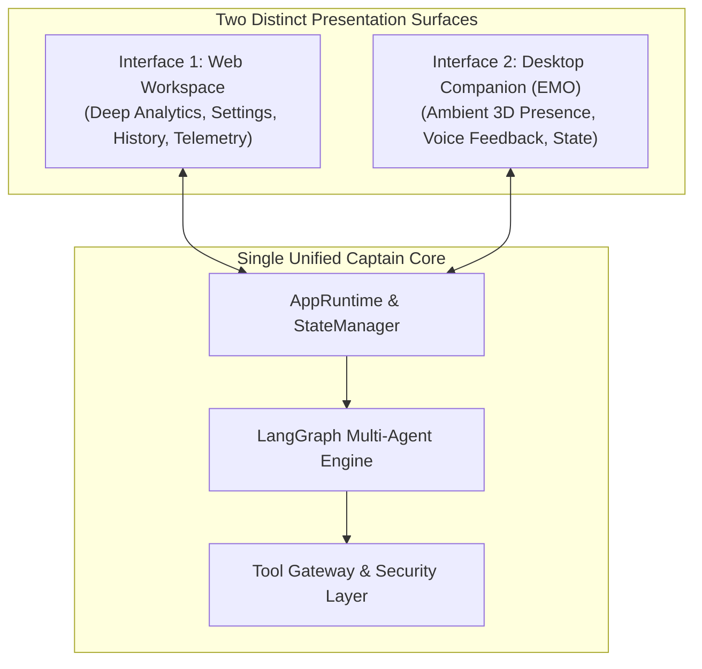
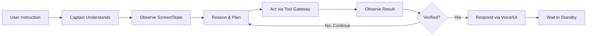

# 🌟 Captain AI OS 2.0 — Product Vision & Philosophy

> **Document:** `01_VISION.md`  
> **Status:** Authoritative Foundation  
> **Target Audience:** All AI Agents & Human Developers

---

## 1. The Core Vision

> **Captain is a Windows-native autonomous AI desktop companion that remains permanently available on the desktop, understands voice and text instructions, observes the computer screen, reasons about what it sees, operates the computer directly, verifies the outcome of its actions, and communicates results back to the user.**

Captain is not merely an assistant you open in a browser tab when you have a question. Captain lives on your desktop, watches your workflow when invoked, manipulates files and applications alongside you, catches errors, and acts as an autonomous digital partner.

---

## 2. Why Captain Exists: The Problem

Traditional computing with AI currently suffers from severe fragmentation:
1. **Isolated Web Chatbots (ChatGPT, Claude web):** Trapped inside browser tabs. They cannot see your active IDE, cannot see runtime error dialogs, cannot manipulate local files, and cannot execute terminal commands on your machine without tedious manual copy-pasting.
2. **Generic Voice Assistants (Siri, Alexa, Cortana):** Limited to basic canned triggers (timers, weather, music playback). They lack deep reasoning, have no concept of software development, and cannot operate desktop GUI applications.
3. **Novelty Desktop Pets:** Purely cosmetic animations that idle on screen without intelligence, tools, or real system integration.
4. **Unconstrained Autonomous Scripts:** Experimental CLI agents that run shell scripts without visual feedback, lack human-in-the-loop safety boundaries, and cannot verify whether a GUI application actually did what was requested.

**Captain solves this by synthesizing intelligence, physical desktop presence, multimodal perception, and secure OS control into a single unified system.**

---

## 3. What Captain Is NOT

To maintain architectural focus, developers and AI agents must remember that Captain is explicitly **NOT**:
- **NOT a generic web chatbot:** It is deeply integrated into Windows APIs, process inspection, and desktop automation.
- **NOT a decorative pet:** The 3D EMO avatar is the visual status indicator of a high-capability multi-agent operating core.
- **NOT a toy voice assistant:** Voice in Captain is the high-bandwidth conversational channel for complex technical instructions (e.g. *"Captain, inspect my terminal, fix the database migration error, and re-run the tests"*).
- **NOT an uncontrolled autonomous agent:** Captain operates within strict zero-trust permission boundaries and requires explicit user confirmation before executing high-risk or destructive actions.
- **NOT a collection of disjointed AI demos:** Every agent, tool, and UI element links back to the centralized `Captain Core` runtime.

---

## 4. The Two Interfaces

Captain presents **exactly two user-facing interfaces** powered by one shared brain:

### Interface 1: The Main Web Interface (Detailed Workspace)
- **Role:** Deep analytical cockpit.
- **Responsibilities:** Extensive conversation history, task planning trees, vector memory inspection, multi-agent activity timelines, system telemetry, configuration settings, and audit logs.
- **Form:** Glassmorphic web dashboard communicating with the FastAPI backend over REST and WebSockets.

### Interface 2: The Desktop Companion (EMO)
- **Role:** Persistent, ambient desktop presence.
- **Responsibilities:** Movable, frameless, transparent 3D avatar living on the Windows desktop. Communicates state visually (thinking, speaking, listening, error), reacts to physical clap activation, and provides instant ambient interaction without opening a window.
- **Form:** PySide6 native frameless overlay container hosting a WebGL/Three.js 3D companion.

---

## 5. The Autonomous Computer-Use Loop

The defining technical breakthrough of Captain is its closed-loop execution paradigm:

$$\text{Observe} \longrightarrow \text{Reason} \longrightarrow \text{Plan} \longrightarrow \text{Act} \longrightarrow \text{Observe Again} \longrightarrow \text{Verify} \longrightarrow \text{Report}$$

Captain does not blindly fire an action and assume success. It:
1. Observes the desktop state before taking action.
2. Executes the action (e.g. clicks a button, edits a file, launches a process).
3. Re-observes the screen or terminal to inspect the real-world outcome.
4. Verifies whether the intended goal was achieved.
5. Continues or self-corrects if the outcome was unsuccessful.

---

## 6. What Captain Feels Like to the User

> The user sits at their Windows workstation. Captain's small EMO avatar rests quietly in the corner of the screen in **STANDBY**.  
> The user claps their hands 👏.  
> EMO lights up, displays attentive animated eyes, and transitions to **ACTIVE**.  
> The user speaks naturally: *"Captain, open VS Code, check why the API server failed to start, and fix it."*  
> EMO pulses cyan (**THINKING**), captures the desktop screen (**OBSERVING**), identifies the error traceback in the terminal, plans the fix, and requests confirmation for the file modification.  
> Upon confirmation, Captain modifies the code and restarts the server (**EXECUTING**).  
> Captain observes the terminal output, verifies that the server bound successfully to port 8000 (**VERIFYING**), and speaks aloud: *"I found a missing environment variable in config.py, corrected it, and the API server is now running smoothly on port 8000."* (**SPEAKING**).  
> The user claps their hands 👏. EMO returns to idle **STANDBY**.

This is the ultimate standard against which all implementation in this project is judged.
