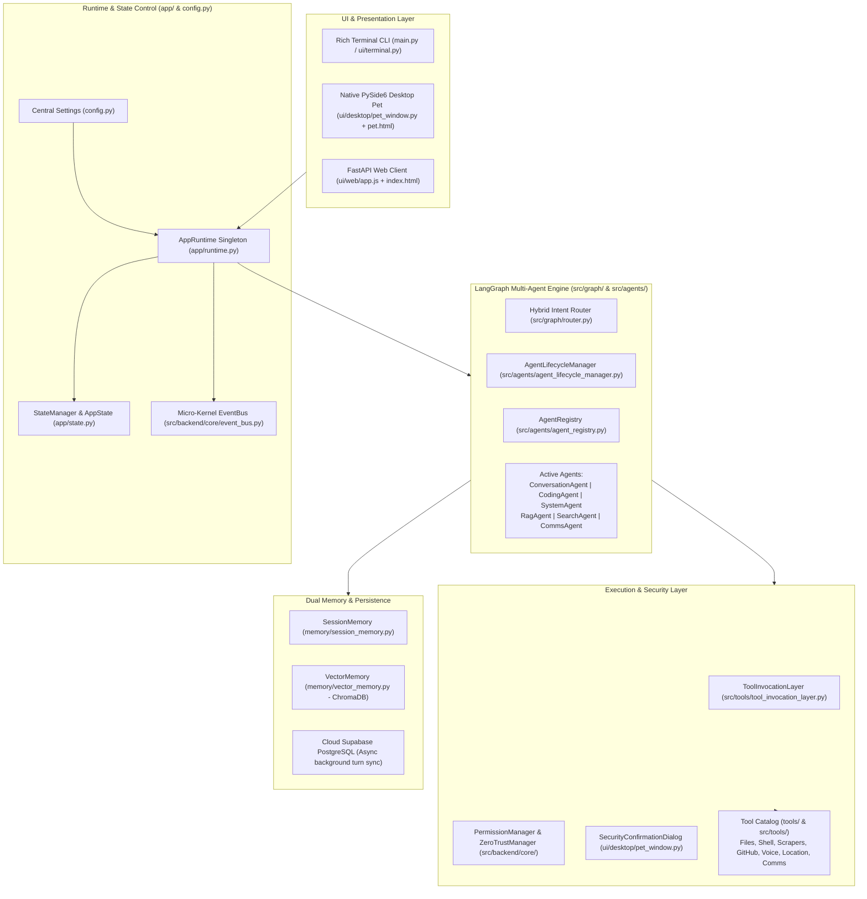
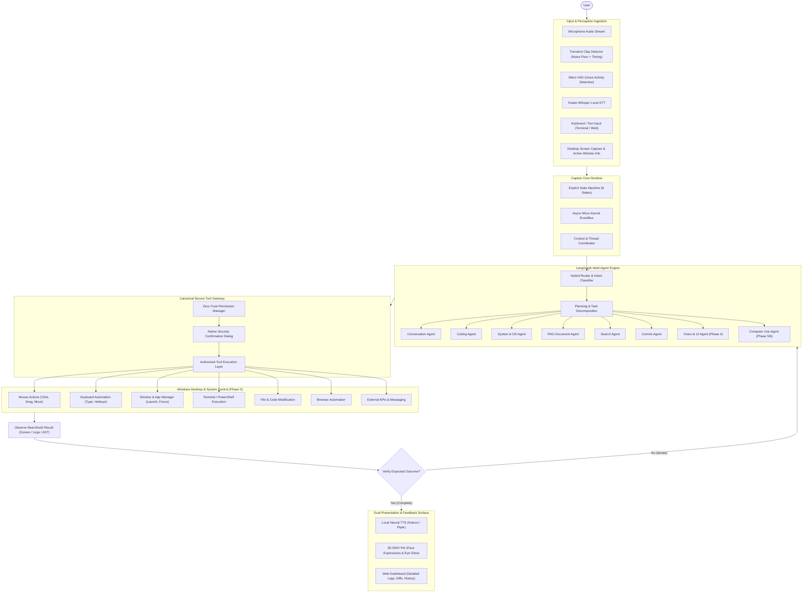

# 🏗️ Captain AI OS 2.0 — System Architecture

> **Document:** `03_ARCHITECTURE.md`  
> **Status:** Authoritative Architectural Blueprint  
> **Rule:** Current Architecture and Target Architecture are strictly segregated.

---

## 1. Current Architecture (As of Commit `bdfaf69`)

The repository reflects the completed **Phase 1** and **Phase 2** baselines, currently transitioning away from legacy V1 prototypes toward the unified V2 enterprise architecture.

---

### 1.1. Directory Structure & Architectural Roles

| Directory / File | Status | Architectural Role |
| :--- | :--- | :--- |
| [`main.py`](file:///d:/captain/main.py) | **ACTIVE** | Central CLI & server entrypoint (`chat`, `desktop`, `serve`, `ingest`, `metrics`, `weather`). |
| [`config.py`](file:///d:/captain/config.py) | **ACTIVE** | Central Pydantic v2 `Settings` object managing all environment, model, voice, and security configs. |
| [`app/`](file:///d:/captain/app) | **ACTIVE** | Core application foundation: [`app/state.py`](file:///d:/captain/app/state.py) (`AppState` machine) and [`app/runtime.py`](file:///d:/captain/app/runtime.py) (`AppRuntime` lifecycle coordinator). |
| [`src/agents/`](file:///d:/captain/src/agents) | **ACTIVE** | V2 multi-agent implementation inheriting from [`BaseAgent`](file:///d:/captain/src/agents/base_agent.py). Coordinated by `AgentRegistry`. |
| [`src/graph/`](file:///d:/captain/src/graph) | **ACTIVE** | LangGraph state graph ([`state_graph.py`](file:///d:/captain/src/graph/state_graph.py)) and hybrid intent router ([`router.py`](file:///d:/captain/src/graph/router.py)). |
| [`src/backend/`](file:///d:/captain/src/backend) | **ACTIVE** | FastAPI REST/WebSocket router (`api/v1/router.py`), micro-kernel services (`event_bus.py`, `permission_manager.py`, `zero_trust_manager.py`). |
| [`src/tools/`](file:///d:/captain/src/tools) | **ACTIVE** | Standardized tool invocation layer ([`tool_invocation_layer.py`](file:///d:/captain/src/tools/tool_invocation_layer.py)) and tool catalog. |
| [`ui/desktop/`](file:///d:/captain/ui/desktop) | **ACTIVE** | Native PySide6 frameless transparent overlay ([`pet_window.py`](file:///d:/captain/ui/desktop/pet_window.py)), hosting 3D EMO pet ([`pet.html`](file:///d:/captain/ui/desktop/pet.html)). |
| [`ui/web/`](file:///d:/captain/ui/web) | **ACTIVE** | Glassmorphic web workspace ([`index.html`](file:///d:/captain/ui/web/index.html), [`app.js`](file:///d:/captain/ui/web/app.js)). |
| [`ui/terminal.py`](file:///d:/captain/ui/terminal.py) | **ACTIVE** | Rich terminal formatting utilities (banners, response cards, agent status tables). |
| [`memory/`](file:///d:/captain/memory) | **ACTIVE** | In-memory session buffers ([`session_memory.py`](file:///d:/captain/memory/session_memory.py)) and ChromaDB vector search ([`vector_memory.py`](file:///d:/captain/memory/vector_memory.py)). |
| [`providers/`](file:///d:/captain/providers) | **ACTIVE** | Provider abstractions (`base.py`) and implementations (`llm/` for Ollama, OpenAI, Gemini). |
| [`tests/`](file:///d:/captain/tests) | **ACTIVE** | 206 automated tests covering units, integration, managers, frontend bibles, and Phase 1/2 baselines. |
| [`agents/`](file:///d:/captain/agents) | **LEGACY (V1)** | Legacy function-based agent nodes. Kept for backward compatibility while migrating to `src/agents/`. |
| [`core/`](file:///d:/captain/core) | **LEGACY (V1)** | Legacy `core/graph.py` and `core/llm.py`. Superseded by `src/graph/` and `app/runtime.py`. |
| [`tools/`](file:///d:/captain/tools) | **MIGRATING** | Standalone tool implementations (`voice.py`, `weather.py`, `file_tools.py`). Invoked via `src/tools/tool_invocation_layer.py`. |

---

### 1.2. Legacy & Duplicate Architecture Policy

The repository currently maintains dual legacy paths:
1. `agents/` (V1) vs `src/agents/` (V2)
2. `core/graph.py` (V1) vs `src/graph/state_graph.py` (V2)
3. `tools/` (legacy direct calls) vs `src/tools/tool_invocation_layer.py` (secure boundary)

**Policy:** Do NOT delete legacy folders blindly. Legacy code is preserved until tests and active runtime are fully converted to `src/`. No production entrypoint in `main.py` invokes V1 code directly.

---

## 2. Target Architecture (Captain AI OS 2.0 Evolution)

The target architecture unifies voice, screen perception, desktop automation, and multi-agent reasoning into a single cohesive, closed-loop operating system:

---

## 3. Key Differences Between Current and Target

| Subsystem | Current State (`bdfaf69`) | Target State (End of Phase 8) |
| :--- | :--- | :--- |
| **Voice Ingest** | Basic `SpeechRecognition`, manual `v` hotkey in CLI. | Always-listening Silero VAD, Clap activation, sub-second Faster-Whisper STT. |
| **Speech Output** | Synchronous `pyttsx3` with robotic timbre. | Local neural streaming TTS (Kokoro/Piper) synced to EMO mouth movements. |
| **Screen Perception** | Static `pyautogui.screenshot()` tool. | Real-time multi-monitor OCR, active-window geometry, and vision model context. |
| **OS Control** | Basic shell command execution and file manipulation. | Full GUI automation: mouse clicks, keyboard entry, application switching, window manipulation. |
| **Execution Loop** | Single-turn LangGraph invoke (Input $\rightarrow$ Tool $\rightarrow$ Text). | Iterative multi-turn autonomous loop (Observe $\rightarrow$ Act $\rightarrow$ Observe $\rightarrow$ Verify). |
| **Companion Pet** | Frameless Qt container displaying 3D animations synced to state. | Bi-directional desktop companion reacting to voice amplitude, mouse interactions, and desktop events. |
