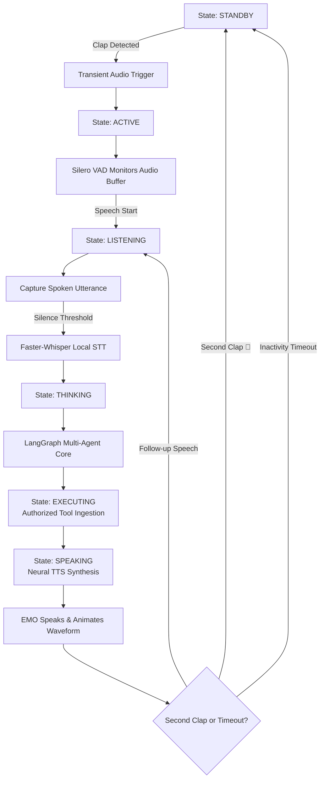
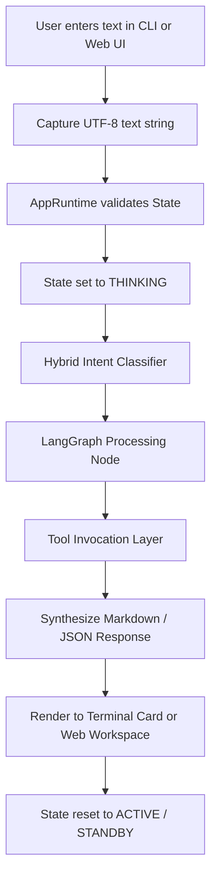
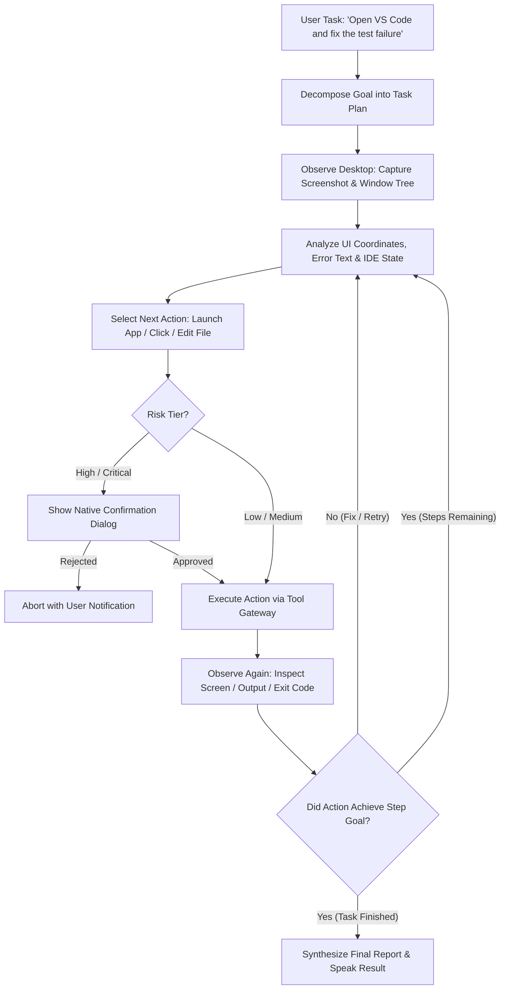
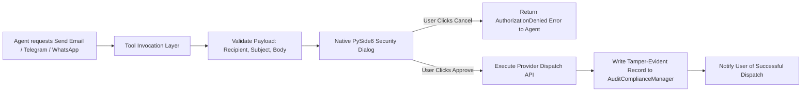

# 🔄 Captain AI OS 2.0 — Execution & Operational Workflows

> **Document:** `04_WORKFLOW.md`  
> **Status:** Authoritative Workflow Specifications  
> **Target Audience:** Multi-Agent Engineers & Core System Developers

---

## 1. Primary Voice Workflow (Ambient Desktop Interaction)

Voice is the primary human interface. The voice pipeline operates from physical acoustic trigger through neural transcription to speech feedback.



### Steps:
1. **Physical Clap Ingestion:** The background microphone stream detects an acoustic transient matching a handclap profile.
2. **State Transition:** State machine transitions from `STANDBY` to `ACTIVE`. EMO awakens and glows.
3. **VAD Windowing:** Real-time Voice Activity Detection opens an audio buffer on speech onset.
4. **Local Transcription:** Audio segment is transcribed locally via Faster-Whisper.
5. **Reasoning & Planning:** The user query is classified and routed across the multi-agent graph.
6. **Execution:** Required tools execute under zero-trust boundaries.
7. **Spoken Response:** Response text is synthesized into local neural audio stream.
8. **Avatar Sync:** Audio amplitude drives mouth movement in the 3D EMO avatar.
9. **Return to Standby:** A second clap or an inactivity timeout returns Captain to `STANDBY`.

---

## 2. Keyboard & Text Fallback Workflow

Text input is available at all times through the Web Interface or Terminal CLI.



---

## 3. Autonomous Computer-Use Workflow (Phase 6)

The core autonomous loop allows Captain to observe the desktop, reason about application state, perform actions, and verify the outcome.



---

## 4. Software Development & Debugging Workflow

A practical demonstration of the computer-use workflow for developer tasks:

```
Step 1: User Command
        "Captain, my API server tests are failing in this project. Find out why and fix it."

Step 2: Observation & Localization
        • Captain inspects current working directory files.
        • Captures terminal output or runs 'pytest tests/' via SystemAgent.
        • Extracts stack trace and error message (e.g., ImportError: cannot import 'Settings').

Step 3: Root Cause Reasoning
        • CodingAgent inspects imported modules and symbol references.
        • Identifies conflicting package names or missing attributes in config.

Step 4: Tool Confirmation & Remediation
        • CodingAgent generates precise minimal unified diff.
        • Security dialog prompts user: "Allow modification to config.py?"
        • Upon approval, writes fix to disk via file_tools.

Step 5: Verification Phase
        • Re-executes 'pytest tests/' to inspect test suite outcome.
        • Verifies exit code == 0 and 0 failures reported.

Step 6: Completion Report
        • EMO avatar speaks: "Fixed the configuration import error. All tests are now passing."
        • Full diff and execution logs rendered in Web Dashboard.
```

---

## 5. External Communication Workflow (Zero-Trust Dispatch)

Sending external messages or emails has irreversible real-world effects and requires mandatory confirmation.


