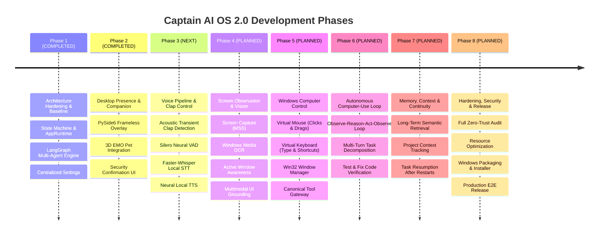

# 🗓️ Captain AI OS 2.0 — Eight-Phase Development Roadmap

> **Document:** `06_PHASES.md`  
> **Status:** Canonical Roadmap Specification  
> **Rule:** Strict Phase Gating. No automatic progression across phases. Each phase requires explicit user authorization before starting.

---

## Roadmap Overview

---

## Phase 1: Architecture Hardening & Baseline

- **Status:** `COMPLETED` (Verified in commit `bdfaf69`)
- **Purpose:** Stabilize the existing codebase into a unified, testable runtime foundation without breaking legacy compatibility.
- **Why we need it:** Legacy prototype V1 had disconnected scripts; a robust state machine and micro-kernel were required for stable multi-agent coordination.
- **Current Starting Point:** Baseline achieved. `AppState` machine, `AppRuntime`, `EventBus`, and 6 V2 agents in `src/agents/` are fully operational.
- **Capabilities:** State machine management, centralized settings, LangGraph agent routing, tool execution layer, and unit test suite.
- **Architecture Changes:** Established canonical `app/` and `src/` hierarchy.
- **Files Affected:** `config.py`, `app/state.py`, `app/runtime.py`, `src/graph/state_graph.py`, `src/agents/`.
- **Dependencies:** `langgraph`, `langchain-ollama`, `pydantic-settings`, `rich`, `typer`.
- **Testing Requirements:** Full unit test suite covering state transitions and runtime lifecycle.
- **Manual Verification:** Terminal CLI chat interaction via `python main.py chat`.
- **Completion Criteria:** All core unit tests pass; state transitions strictly validated.
- **Risks:** Import collisions between root `config.py` and external packages.
- **What is explicitly NOT included:** Audio processing, desktop GUI overlay, computer automation.

---

## Phase 2: Desktop Presence & Interaction Foundation

- **Status:** `COMPLETED` (Verified in commit `bdfaf69`)
- **Purpose:** Transform Captain from a terminal script into an ambient, persistent desktop companion.
- **Why we need it:** Users should not have to keep terminal windows open; the companion must live ambiently on the desktop.
- **Current Starting Point:** Completed. PySide6 frameless transparent overlay hosting 3D EMO avatar is running and tested.
- **Capabilities:** Frameless transparent window, draggable positioning, system tray menu, 3D WebGL avatar rendering, Qt state synchronization, and native security dialog.
- **Architecture Changes:** Added `ui/desktop/` with `pet_window.py` (container and `SecurityConfirmationDialog`) and `pet.html`.
- **Files Affected:** `ui/desktop/pet_window.py`, `ui/desktop/__init__.py`, `ui/desktop/pet.html`, `main.py`.
- **Dependencies:** `PySide6`.
- **Testing Requirements:** 8 unit tests in `tests/unit/test_phase2_desktop_pet.py`.
- **Manual Verification:** Launch `python main.py desktop`, drag pet window across screen, trigger state changes, verify tray menu exit.
- **Completion Criteria:** Pet window displays transparently on top of other windows, moves smoothly, and shuts down cleanly.
- **Risks:** WebGL rendering issues on machines without hardware acceleration.
- **What is explicitly NOT included:** Voice capture, screen capture, mouse control.

---

## Phase 3: Voice Input/Output + Clap Control

- **Status:** `COMPLETED` (Verified & Tested)
- **Purpose:** Build the primary natural interaction system: clap wake-up, voice activity detection, local speech transcription, and neural speech synthesis.
- **Why we need it:** Voice is Captain's primary interaction model; clap activation provides frictionless, hands-free presence control.
- **Current Starting Point:** Basic blocking `SpeechRecognition` and `pyttsx3` in `tools/voice.py`.
- **Capabilities:**
  1. Acoustic transient clap detection (toggle between `STANDBY` and `ACTIVE`).
  2. Silero Neural VAD for ambient speech segmentation.
  3. Faster-Whisper local STT running sub-second transcription.
  4. Neural local TTS (Kokoro/Piper) with real-time speech output.
  5. Audio-reactive amplitude streaming to EMO avatar mouth.
  6. Interruption / barge-in detection.
- **Architecture Changes:** Create `src/voice/` (`voice_manager.py`, `clap_detector.py`, `vad.py`, `audio_capture.py`) and provider abstractions in `providers/stt/` (`faster_whisper.py`) and `providers/tts/` (`pyttsx3.py`, `piper.py`).
- **Files Affected:** `src/voice/`, `providers/stt/`, `providers/tts/`, `config.py`, `app/runtime.py`, `ui/desktop/pet_window.py`, `ui/desktop/pet_view.js`.
- **Dependencies:** `sounddevice`, `numpy`, `scipy`, `faster-whisper`, `kokoro-onnx` (or `piper-tts`), `onnxruntime`.
- **Testing Requirements:** Synthetic audio signal tests for clap rise-time, VAD accuracy tests on sample WAVs, STT transcription accuracy tests.
- **Manual Verification:** Live microphone test on Windows hardware: clap hands to wake up, speak command, verify verbal response and avatar animation, clap to sleep.
- **Completion Criteria:** Double-clap reliably toggles state; speech transcribes accurately in <1.2s; TTS speaks smoothly; avatar mouth animates in sync.
- **Risks:** False activations from keyboard typing; microphone driver incompatibilities on Windows.
- **What is explicitly NOT included:** Screen OCR, desktop mouse/keyboard automation, autonomous computer-use.

---

## Phase 4: Screen Observation & Understanding

- **Status:** `PLANNED`
- **Purpose:** Give Captain visual awareness of what the user is seeing on the Windows desktop.
- **Why we need it:** Captain cannot debug code, inspect errors, or operate desktop apps without seeing the screen.
- **Current Starting Point:** Static `pyautogui.screenshot()` tool in `tools/system_tools.py`.
- **Capabilities:**
  1. Fast multi-monitor screenshot capture via DirectX / `mss`.
  2. Active window geometry and title tracking via Win32.
  3. Local OCR text extraction (Windows Media OCR or Tesseract) with bounding box coordinates.
  4. Multimodal LLM visual reasoning for desktop error and UI analysis.
- **Architecture Changes:** Create `src/vision/` with `screen_observer.py`, `ocr_engine.py`, `window_tracker.py`, and `visual_grounding.py`.
- **Files Likely Affected:** `src/vision/`, `src/agents/`, `tools/system_tools.py`.
- **Dependencies:** `mss`, `pywin32`, `winsdk` / `pytesseract`.
- **Testing Requirements:** Synthetic image OCR tests, window tracking mock tests, screen capture coordinate validation.
- **Manual Verification:** Ask Captain: *"What application is open on my screen right now?"* and *"What error does this terminal window show?"*.
- **Completion Criteria:** Captain correctly reads text from visible windows and outputs accurate bounding box coordinates.
- **Risks:** Multi-DPI scaling issues across high-resolution displays.
- **What is explicitly NOT included:** Virtual mouse clicks, automated typing, unsupervised app manipulation.

---

## Phase 5: Windows Computer Control

- **Status:** `PLANNED`
- **Purpose:** Provide safe, canonical desktop automation tools under the Tool Gateway.
- **Why we need it:** To operate applications, type into IDEs, click buttons, and switch tasks on behalf of the user.
- **Current Starting Point:** Shell command execution in `SystemAgent` and file tools in `tools/file_tools.py`.
- **Capabilities:**
  1. Safe virtual mouse controller (movement, clicks, double-clicks, drags).
  2. Virtual keyboard injector (typing strings, key combinations, hotkeys).
  3. Window manager (launching applications, focusing HWNDs, minimizing/maximizing).
  4. Clipboard manipulation.
  5. Canonical integration under `ToolInvocationLayer` with security dialog interception.
- **Architecture Changes:** Create `src/control/` with `mouse_controller.py`, `keyboard_controller.py`, and `window_manager.py`.
- **Files Likely Affected:** `src/control/`, `src/tools/`, `src/backend/core/permission_manager.py`.
- **Dependencies:** `pywin32`, `pyautogui` (wrapped securely).
- **Testing Requirements:** Safe mock automation tests verifying boundary limits and permission rejections.
- **Manual Verification:** Command Captain: *"Open Notepad and type 'Hello World'"*; verify confirmation dialog appears, executes, and types into Notepad.
- **Completion Criteria:** Mouse and keyboard actions execute reliably on active foreground windows with zero unintended clicks.
- **Risks:** Loss of window focus leading to keystroke misdirection.
- **What is explicitly NOT included:** Autonomous multi-step decision loops without human checkpoints.

---

## Phase 6: Autonomous Computer-Use Loop

- **Status:** `PLANNED`
- **Purpose:** Combine vision, reasoning, tools, and verification into a continuous autonomous execution loop.
- **Why we need it:** True digital partnership requires executing multi-step instructions (e.g. *"Fix the broken tests in my project"*) without micro-managing every keystroke.
- **Current Starting Point:** Single-turn LangGraph invoke in `src/graph/state_graph.py`.
- **Capabilities:**
  1. Multi-turn task planning and decomposition.
  2. Iterative **Observe $\rightarrow$ Reason $\rightarrow$ Act $\rightarrow$ Observe $\rightarrow$ Verify** loop.
  3. Action outcome verification (e.g. inspecting terminal exit codes and OCR text to verify success).
  4. Self-correction on failure (retry, adjust code, re-test).
  5. Human-in-the-loop interruption and stop-signal listening.
- **Architecture Changes:** Create `src/loop/` with `task_planner.py`, `execution_loop.py`, and `verifier.py`.
- **Files Likely Affected:** `src/loop/`, `src/graph/state_graph.py`, `app/runtime.py`.
- **Dependencies:** `langgraph`, `pydantic`.
- **Testing Requirements:** End-to-end simulated coding and debugging loop tests with controlled failure injection.
- **Manual Verification:** End-to-end task: *"Open project, locate syntax error, apply fix, run pytest, and confirm all pass"*.
- **Completion Criteria:** Captain executes a multi-step engineering task autonomously, self-corrects on error, and stops when verified.
- **Risks:** Infinite retry loops on unresolved bugs (mitigated by maximum iteration counter).
- **What is explicitly NOT included:** Unrestricted long-term cross-session task resumption (deferred to Phase 7).

---

## Phase 7: Memory, Context & Reliable Long-Run Tasks

- **Status:** `PLANNED`
- **Purpose:** Provide deep context retention across days, sessions, and large software projects.
- **Why we need it:** Captain must remember previous user instructions, project architectural patterns, and resume tasks after restarts.
- **Current Starting Point:** In-memory `session_memory.py` and basic ChromaDB `vector_memory.py`.
- **Capabilities:**
  1. Persistent SQLite/PostgreSQL session storage.
  2. Cross-session long-term semantic memory with auto-summarization.
  3. Project codebase indexing and architectural recall.
  4. Task state persistence (checkpointing interrupted long-running tasks).
  5. Context window compression to fit local LLM context limits.
- **Architecture Changes:** Refactor `memory/` into `src/memory/` with `persistent_session.py`, `semantic_memory.py`, and `task_checkpoint.py`.
- **Files Likely Affected:** `memory/`, `src/memory/`, `src/backend/core/`.
- **Dependencies:** `chromadb`, `sqlite3`, `pydantic`.
- **Testing Requirements:** Persistence recovery tests across process restarts; relevance filtering tests.
- **Manual Verification:** Give instructions, restart Captain, and ask: *"What were we working on before restart?"*.
- **Completion Criteria:** Full conversational and task context restored accurately after complete system reboot.
- **Risks:** Vector memory bloat and stale context contamination.
- **What is explicitly NOT included:** Production installer and packaging.

---

## Phase 8: System Integration, Security Hardening & Production Release

- **Status:** `PLANNED`
- **Purpose:** Polish, secure, optimize, package, and release Captain AI OS 2.0 as a production-grade Windows application.
- **Why we need it:** The system must be stable, secure against exploits, resource-efficient, and easy to install on any Windows 10/11 PC.
- **Current Starting Point:** Development repository running out of a local Python virtual environment.
- **Capabilities:**
  1. Comprehensive security audit (zero-trust boundaries, credential masking, path sanitization).
  2. Resource optimization (GPU/CPU throttling, memory leak prevention).
  3. Automated Windows startup service / background daemon.
  4. PyInstaller / InnoSetup packaging into a single Windows installer (`.exe`).
  5. Complete user documentation, tutorials, and release notes.
- **Architecture Changes:** Build scripts and packaging specifications in `build/`.
- **Files Likely Affected:** Entire repository, `setup.py`, `build/`.
- **Dependencies:** `pyinstaller`, `pytest`.
- **Testing Requirements:** Full regression test suite (>300 tests), clean-room Windows VM installation test.
- **Manual Verification:** Install from standalone `.exe` on a fresh Windows machine, run through complete voice, vision, and coding workflows.
- **Completion Criteria:** Single-click installer installs Captain; boots with Windows; passes all security audits; consumes <500MB idle RAM.
- **Risks:** Anti-virus false positives due to desktop automation APIs.
- **What is explicitly NOT included:** Non-Windows platform ports (macOS / Linux deferred to future versions).
