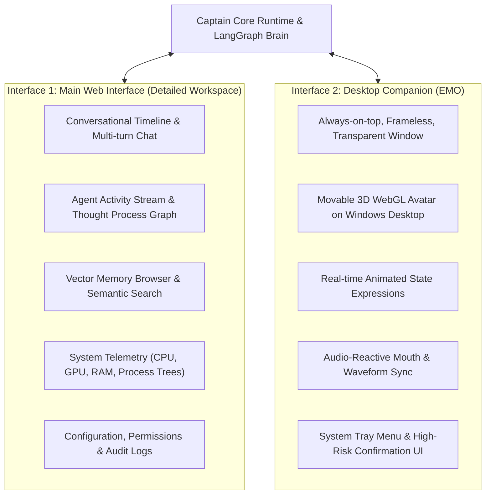
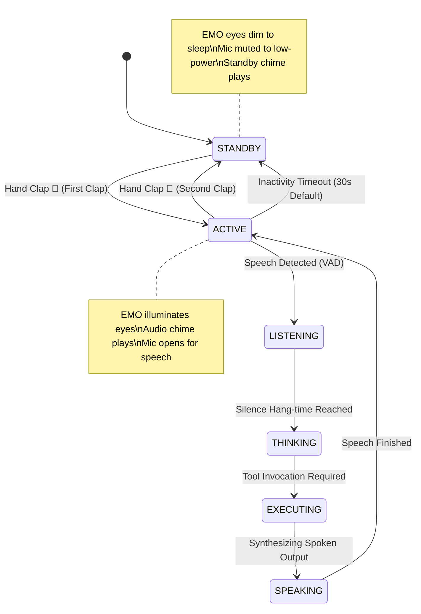

# 🤝 Captain AI OS 2.0 — User Interaction Model

> **Document:** `07_INTERACTION_MODEL.md`  
> **Status:** Canonical Interaction Specification  
> **Scope:** Defines user interface topology, physical clap activation, voice modality, and EMO state reflection.

---

## 1. Dual Interface Topology

Captain provides **exactly two user-facing interfaces** powered by a single underlying runtime core:

---

## 2. Input Modalities

### 2.1. Voice (Primary Modality)
- **Design Principle:** Frictionless, hands-free ambient interaction.
- **Workflow:** The user speaks naturally from anywhere in the room. Voice is segmented via Voice Activity Detection (VAD) and transcribed locally via Faster-Whisper.
- **Primary Use Cases:** Direct instructions, status queries, multi-step engineering tasks, conversational exploration.
- **Example:** *"Captain, check git status, commit the current changes, and push to main."*

### 2.2. Keyboard / Text (Optional Fallback)
- **Design Principle:** Precision, privacy in public environments, and code snippet sharing.
- **Workflow:** User types instructions into the Rich Terminal CLI or the Web Workspace input field.
- **Primary Use Cases:** Noisy environments, pasting long code blocks or stack traces, quiet working hours.
- **Parity Rule:** Every action achievable via voice must be equally achievable via keyboard, and vice versa.

---

## 3. Physical Clap Activation Model

Captain incorporates physical acoustic activation to transition between idle standby and active listening without needing a constant wake-word or hotkey.

### 3.1. Acoustic Clap Detection Requirements
1. **Continuous Low-Power Stream:** Audio is sampled at 16kHz mono through a lightweight ring buffer.
2. **Dynamic Noise-Floor Tracking:** The detector calculates running RMS energy to establish a dynamic noise floor.
3. **Bandpass Filtering:** Audio is bandpass-filtered between 2.0 kHz and 4.5 kHz to isolate the sharp acoustic snap of a handclap.
4. **Transient Rise-Time Validation:** A clap exhibits an explosive energy rise-time of less than 15 milliseconds. Signals with gradual attack (speech, music, wind) are rejected.
5. **False-Positive Prevention:** The detector ignores continuous sounds, keyboard clicks (lower frequency, repetitive rhythm), door slams (low-frequency resonance < 500 Hz), and mouse clicks (insufficient energy).
6. **Development Hotkey Fallback:** A configurable global Windows hotkey (`Win + Shift + C`) provides an instant fallback for quiet environments.

---

## 4. EMO Desktop Companion: Visual State Embodiment

**EMO is not a separate AI.** EMO is the physical and visual embodiment of Captain's internal `AppState`.

The 3D avatar updates its eyes, face mesh, and lighting in real time based on state machine events broadcast by `StateManager`:

| System State | EMO Face Expression | Eye Animation & Color | Physical Movement | Meaning to User |
| :--- | :--- | :--- | :--- | :--- |
| **`STANDBY`** | Relaxed / Sleeping | Dimmed blue / closed slits | Gentle slow breathing bob | Captain is idle, conserving resources, listening only for claps. |
| **`ACTIVE`** | Awake / Attentive | Bright solid cyan circles | Bounces upright, faces cursor | Captain is awake, waiting for the user to speak or type. |
| **`LISTENING`** | Wide attentive | Animated expanding cyan rings | Leans forward toward audio | Microphone is recording speech; VAD window active. |
| **`THINKING`** | Focused / Processing | Rotating orbital dots / pulse | Slight tilt of head | Multi-agent graph is reasoning, planning, or routing. |
| **`OBSERVING`** | Inspecting screen | Scanning horizontal blue line | Head tilts upward/sideways | Capturing screenshot, parsing OCR, reading UI coordinates. |
| **`EXECUTING`** | Busy / Focused | Amber / Gold gear spinner | Rapid subtle tool vibrations | Executing tools (shell command, file write, web search). |
| **`SPEAKING`** | Conversational | Synchronized audio waveform | Mouth opening matches FFT volume | Synthesizing and speaking neural TTS response aloud. |
| **`ERROR`** | Concerned / Apologetic | Flashing soft amber/red exclamation | Drops head slightly, self-recovers | Handled exception occurred; auto-recovery initiated. |

---

## 5. Audio-Visual Feedback System

To provide immediate clarity to the user, state transitions are paired with subtle, elegant audio chimes:
- **Wake Chime (`STANDBY` $\rightarrow$ `ACTIVE`):** Soft ascending two-tone chime (440 Hz $\rightarrow$ 880 Hz, 80ms).
- **Sleep Chime (`ACTIVE` $\rightarrow$ `STANDBY`):** Soft descending two-tone chime (880 Hz $\rightarrow$ 440 Hz, 80ms).
- **Confirmation Chime:** Distinct chime when a high-risk action completes successfully.
- **Audio Mute:** Users can mute all spoken voice output at any time by right-clicking EMO's tray menu or typing `/tts` in the terminal.
