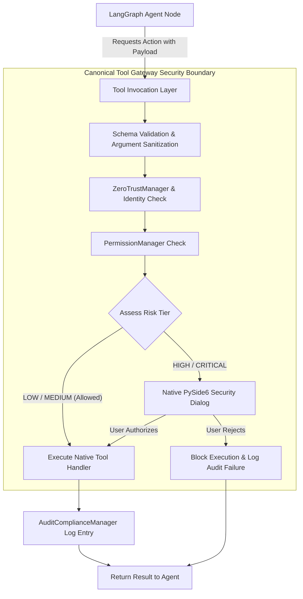

# 🛡️ Captain AI OS 2.0 — Security, Permissions & Governance

> **Document:** `08_SECURITY.md`  
> **Status:** Canonical Security Specification  
> **Core Principle:** Captain may be autonomous, but autonomy must operate strictly inside explicit, verifiable security boundaries.

---

## 1. Zero-Trust Security Architecture

In Captain AI OS 2.0, no agent, script, or external LLM output is trusted by default. Every action that touches the operating system, disk, network, or third-party communications must pass through the **Canonical Tool Gateway**.



---

## 2. Action Risk Classification Matrix

Every tool and action in Captain is classified into one of four immutable risk tiers:

| Risk Tier | Criteria | Example Actions | Authorization Requirement |
| :--- | :--- | :--- | :--- |
| **`LOW`** | Read-only operations that do not modify state or leak credentials. | Reading local documentation, querying system metrics (CPU/RAM), web searches, weather lookup. | Automatically permitted. |
| **`MEDIUM`** | Non-destructive modifications confined to local scratch/workspace environments. | Writing scratch scripts in `.captain_scratch/`, creating non-executable text notes, opening public URLs in browser. | Permitted within active session context. |
| **`HIGH`** | Operations that modify existing user files, manipulate GUI controls, or access sensitive context. | Overwriting existing project code files, moving the mouse/clicking on external apps, typing keystrokes into foreground apps, killing non-Captain processes. | **Requires explicit user consent via Security Confirmation Dialog** or active elevated session grant. |
| **`CRITICAL`** | Irreversible actions, external communication, credential access, or arbitrary system modification. | Deleting files or directories (`rmdir /s`), executing arbitrary shell/PowerShell commands, sending Telegram/WhatsApp messages, dispatching SMTP emails, accessing `.env` keys. | **Mandatory human confirmation on every single invocation.** Cannot be bypassed automatically. |

---

## 3. Human-in-the-Loop Confirmation Dialog

When an agent requests a `HIGH` or `CRITICAL` risk operation, the runtime pauses execution and pops up the native PySide6 `SecurityConfirmationDialog` on the desktop:

### Dialog Specification:
- **Presentation:** Modal window floating directly adjacent to the EMO companion.
- **Visuals:** Amber warning banner (`HIGH`) or Red shield banner (`CRITICAL`).
- **Information Displayed:**
  - Requesting Agent name (e.g. `CodingAgent`, `SystemAgent`).
  - Exact action requested (e.g. `execute_shell_command`).
  - Full parameter preview (e.g. the exact shell command string or file path diff).
  - Risk explanation (e.g. *"This command will execute arbitrary code in PowerShell"*).
- **User Actions:**
  - **`[Allow Once]`**: Permits this single specific execution.
  - **`[Deny]`**: Rejects execution; returns `PermissionDeniedException` to the agent.
  - **`[Allow for Session]`** *(Available only for `HIGH` risk, NEVER for `CRITICAL`)*: Temporarily whitelists this specific tool for the current conversation thread.

---

## 4. Credential & Secrets Management

1. **Zero-Hardcoding Policy:** No API keys, database credentials, or tokens may ever be hardcoded into Python files or tests.
2. **Environment Variable Ingestion:** All secrets are ingested strictly from `.env` via `config.py` using Pydantic `SecretStr`.
3. **Log Sanitization:** `loguru` formatters and `AuditComplianceManager` automatically mask known secrets, tokens, and authorization headers before writing to log files or terminal output:
   $$\text{"ghp_ABC12345XYZ"} \longrightarrow \text{"ghp_***...XYZ"}$$
4. **Agent Context Scrubbing:** Prompts sent to external cloud LLM providers (Gemini, OpenRouter) are filtered by `PrivacyManager` to prevent accidental leakage of local `.env` keys.

---

## 5. File System & Path Boundaries

1. **Path Traversal Prevention:** The file tools resolve all paths with `pathlib.Path.resolve()` and verify that paths do not traverse into protected operating system directories (`C:\Windows\System32`, user credential stores).
2. **Safe Scratch Space:** Autonomous experiments, temporary data scripts, and generated test files are strictly confined to the designated workspace scratch directory:
   $$\text{D:\textbackslash captain\textbackslash.captain_scratch\textbackslash}$$
3. **No Silent Overwrites:** If an agent attempts to write to an existing source code file without explicit user instruction, the action is escalated to `HIGH_RISK`.

---

## 6. Audit & Compliance Logging

All tool invocations—whether permitted, rejected, or failed—are recorded into a structured, tamper-evident JSON-lines log file managed by `AuditComplianceManager`:

```json
{
  "timestamp": "2026-09-23T12:00:00Z",
  "session_id": "captain_session_1",
  "agent_id": "SystemAgent",
  "tool_name": "execute_shell_command",
  "arguments": {"command": "git status -s"},
  "risk_tier": "CRITICAL",
  "authorization_status": "APPROVED_BY_USER",
  "execution_duration_ms": 42,
  "exit_code": 0
}
```

This ensures complete forensic transparency over every action Captain has ever taken on the user's computer.
