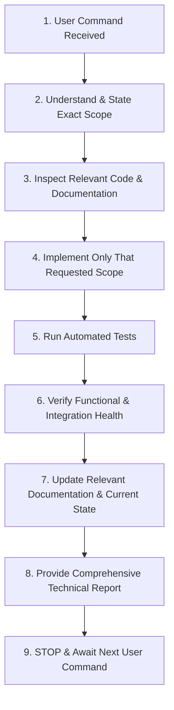

# ⚖️ Captain AI OS 2.0 — Strict Development Rules & Agent Operating Contract

> **Document:** `09_DEVELOPMENT_RULES.md`  
> **Status:** Mandatory Operating Contract  
> **Applicability:** All AI Agents (Antigravity, Codex, Claude Code, etc.) and Human Engineers

---

## 1. The 20 Immutable Development Rules

Every agent operating within this repository is bound by these 20 hard rules:

1. **RULE 1 — Do Not Start From Scratch:** Captain is an established system with extensive Phase 1 and Phase 2 implementations. Controlled rebuilding and hardening only. Never wipe or restart the project.
2. **RULE 2 — Inspect Existing Code Before Modifying It:** Always read existing modules, investigate callers, check test coverage, and understand dependencies before editing any file.
3. **RULE 3 — Preserve Working Functionality:** Working subsystems (`app/state.py`, `app/runtime.py`, `ui/desktop/`, `src/agents/`) must remain functional. Do not break existing capabilities to add new ones.
4. **RULE 4 — Implement Exactly What the User Commands:** The user's explicit prompt defines the strict boundary of your work. Do not exceed it.
5. **RULE 5 — Never Invent New Features:** Do not introduce unrequested utilities, side-features, or "nice-to-have" additions.
6. **RULE 6 — Never Expand Scope:** Keep changes laser-focused on the assigned task. Never infer vague opportunities as permission to implement them.
7. **RULE 7 — Never Modify Unrelated Code:** If working on audio, do not touch memory. If working on vision, do not touch web UI.
8. **RULE 8 — No Random Refactoring:** Do not clean up, rename, reformat, or refactor working code simply because you prefer a different aesthetic.
9. **RULE 9 — No Dependencies Without Justification & Approval:** Never install a package without checking Windows compatibility, Python version compatibility, and explaining why existing dependencies cannot solve the problem.
10. **RULE 10 — No Silent Architectural Decisions:** Never make major architectural choices (e.g. switching frameworks, altering graph design, adding an external service) without explicit user consent.
11. **RULE 11 — If Blocked, Stop and Ask:** When encountering design ambiguity or a critical fork in implementation, report the options, state the recommended approach, and wait for instruction.
12. **RULE 12 — Test Every Change:** Every modification must be validated against existing automated unit tests and new tests specifically written for the changed behavior.
13. **RULE 13 — Report Actual Results, Not Assumed Results:** State real test outputs, real exit codes, and real observed errors. Never claim tests passed without running them.
14. **RULE 14 — Update Relevant Documentation:** When a capability, state machine transition, or architecture changes, update the corresponding file in `captain_docs/`.
15. **RULE 15 — Update GitHub at Appropriate Phase Boundaries:** Follow the formal Git commit and release protocol defined in [`10_GITHUB_WORKFLOW.md`](file:///d:/captain/captain_docs/10_GITHUB_WORKFLOW.md).
16. **RULE 16 — Stop After Completing the Requested Task:** Once the requested command is fulfilled and verified, **STOP IMMEDIATELY**.
17. **RULE 17 — Wait for the Next Command:** Never proceed to follow-up tasks without an explicit prompt from the user.
18. **RULE 18 — Never Automatically Start the Next Phase:** Phase progression has a hard stop-gate. Only the user can authorize beginning the next phase.
19. **RULE 19 — Truthfulness in Implementation Status:** Never claim a feature is implemented if it is only a stub, mock, simulation, or placeholder. Always label accurately.
20. **RULE 20 — Tests Do Not Equal Real-World Hardware Verification:** Passing unit tests alone does not prove that microphones, speakers, screen capture, or mouse control function on real Windows hardware. Explicitly distinguish unit test success from live hardware verification.

---

## 2. Command Execution Protocol

For every single user request, follow this exact linear execution pipeline:



---

## 3. Unrelated Observation Policy (No Self-Expansion)

If an agent notices a bug, flaw, or architectural flaw in an unrelated subsystem while working on a task:

$$\textbf{DO NOT FIX IT SILENTLY.}$$

Instead, follow this reporting protocol:

```markdown
### Unrelated Observation
- **Component:** memory/session_memory.py
- **Observation:** Found a potential SQLite lock issue during concurrent writes.
- **Action Taken:** NONE. Left untouched because it is outside the scope of the current task.
- **Recommendation:** Can be addressed in a future task if requested.
```

Then proceed with the assigned task, complete it, and **STOP**.
