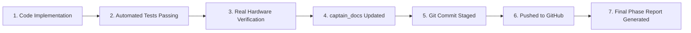

# 🐙 Captain AI OS 2.0 — GitHub Workflow & Release Conventions

> **Document:** `10_GITHUB_WORKFLOW.md`  
> **Status:** Canonical Version Control Standard  
> **Repository:** [adil1378/captain-AI-assistant](https://github.com/adil1378/captain-AI-assistant)  
> **Target Branch:** `main`

---

## 1. Commit Granularity & Phase Boundaries

Do not generate noisy, meaningless micro-commits for every minor file edit. Instead, commits should reflect coherent, tested units of work aligned with phase milestones.

### When to Commit:
1. **At the completion of a Phase Milestone:** Once a phase has met its Definition of Done.
2. **At a Significant, Verified Subsystem Boundary:** (e.g. completing and testing the clap detection engine before moving to STT).
3. **When Documenting Master Knowledge System Initialization:** (e.g. this initialization task).

---

## 2. Commit Message Standards

Commit messages must follow the **Conventional Commits** specification, explicitly identifying the Phase or subsystem:

### Phase Milestone Convention:
```
feat(phase-X): <concise description of phase capability>

- Detailed bullet point of key component added/rebuilt
- Verification and test summary
- Documentation reference
```

### Examples:
- `feat(phase-3): implement native voice pipeline and acoustic clap activation`
- `feat(phase-4): implement screen capture and Windows OCR text extraction`
- `fix(runtime): resolve audio buffer overflow in VAD stream`
- `docs(knowledge): initialize permanent captain_docs continuity system`

---

## 3. The Definition of Done (Phase Release Gate)

A phase is **NOT** complete merely because code has been written. A phase achieves `COMPLETE` status only when all seven elements are verified:



If any of these 7 steps is missing:
$$\textbf{STATUS = PARTIAL (Never COMPLETE)}$$

---

## 4. Working Tree Hygiene

Before staging files for a phase commit, ensure that:
1. **No Temporary Files:** Scratch scripts, `.pytest_cache`, `__pycache__`, and temporary test WAV/PNG files are excluded via `.gitignore`.
2. **No Secret Leaks:** `.env` is never staged. Only `.env.example` is tracked.
3. **No Foreign Repositories:** Untracked external reference repositories (e.g. `github_projects/`) must remain ignored and excluded from commits.
4. **Pytest Run Is Scoped:** Always verify tests with `pytest tests/` to prevent module shadowing from untracked folders.

---

## 5. Rollback Strategy

If a regression is discovered during integration testing:
1. **Never force-push (`git push -f`)** to `main` without explicit human authorization.
2. Use `git revert <commit_hash>` to create a clean, traceable rollback commit.
3. Update `captain_docs/11_CURRENT_STATE.md` and `12_CHANGELOG.md` immediately to reflect the rollback.
