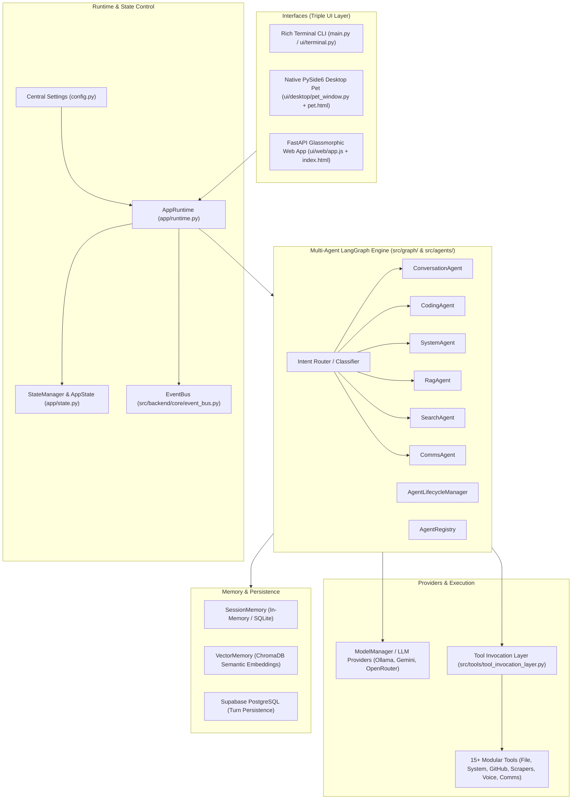
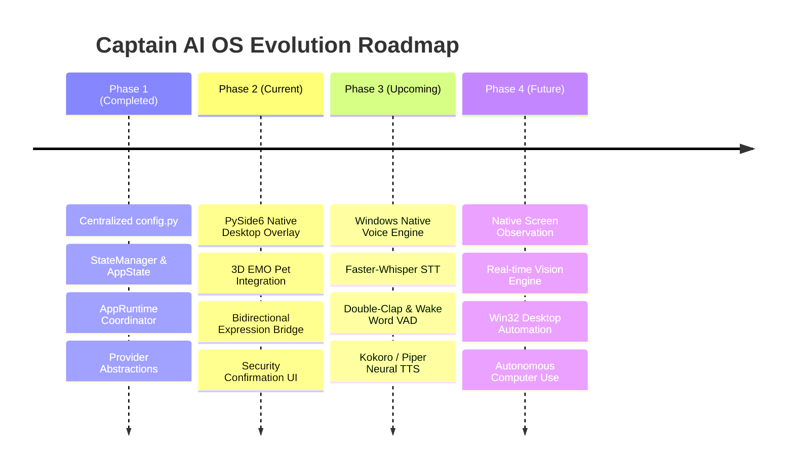

# 🗺️ Captain AI OS 2.0 — Comprehensive Codebase Map

> **Generated via `/gsd-map-codebase`**  
> **Repository Root:** `d:\captain`  
> **Target Version:** Captain AI OS 2.0 (Windows-Native Desktop Autonomous Agent)  
> **Current Architecture Status:** Transitioning from Dual Legacy (V1/V2 Web Hybrid) to Unified Phase 2 Desktop OS Architecture.

---

## 1. Executive System Overview

**Captain** is an autonomous desktop multi-agent operating ecosystem. It combines real-time voice interaction, screen/vision observation, local LLM orchestration (Ollama with cloud fallbacks), vector/session memory, and deep OS automation (file manipulation, hardware monitoring, messaging, and scraping) with an animated 3D desktop companion avatar.



---

## 2. Directory Hierarchy & Architectural Roles

| Directory / File | Type | Architectural Role & Description |
| :--- | :--- | :--- |
| [`main.py`](file:///d:/captain/main.py) | **CLI & Server Entrypoint** | Typer CLI providing commands: `chat` (interactive multi-agent CLI), `desktop` (desktop pet), `serve` (FastAPI), `ingest` (RAG document ingest), `metrics` (hardware stats), and `weather`. |
| [`config.py`](file:///d:/captain/config.py) | **Central Configuration** | Unified Pydantic `Settings` model managing LLM configurations, voice (VAD, STT, TTS), vision parameters, local scratch directories, and security risk levels. |
| [`app/`](file:///d:/captain/app) | **App Core & State Machine** | **Phase 1 Foundation**: Contains [`app/state.py`](file:///d:/captain/app/state.py) (`AppState` machine: STANDBY, ACTIVE, LISTENING, THINKING, OBSERVING, EXECUTING, SPEAKING, ERROR) and [`app/runtime.py`](file:///d:/captain/app/runtime.py) (Lifecycle Coordinator). |
| [`src/agents/`](file:///d:/captain/src/agents) | **V2 Multi-Agent Layer** | Autonomous agents built on `BaseAgent`: `ConversationAgent`, `CodingAgent`, `SystemAgent`, `RagAgent`, `SearchAgent`, `CommsAgent`, coordinated by `AgentRegistry` and `AgentLifecycleManager`. |
| [`src/graph/`](file:///d:/captain/src/graph) | **LangGraph Orchestration** | [`state_graph.py`](file:///d:/captain/src/graph/state_graph.py) and [`router.py`](file:///d:/captain/src/graph/router.py). Implements hybrid rule-based and semantic intent classification routing across agents. |
| [`src/backend/`](file:///d:/captain/src/backend) | **FastAPI & Enterprise Kernel** | Micro-kernel services: `EventBus`, `ModelManager`, `PermissionManager`, `TaskQueue`, `ZeroTrustManager`, `AuditComplianceManager`, and REST/WebSocket API router (`api/v1/router.py`). |
| [`providers/`](file:///d:/captain/providers) | **Provider Abstractions** | Abstract provider interface (`base.py`) and unified LLM providers (`providers/llm/` for Ollama, OpenAI, Gemini) with fallback handling. |
| [`ui/desktop/`](file:///d:/captain/ui/desktop) | **Native Desktop Overlay** | **Phase 2 Foundation**: [`pet_window.py`](file:///d:/captain/ui/desktop/pet_window.py) (Frameless, transparent, always-on-top PySide6 desktop container), hosting [`pet.html`](file:///d:/captain/ui/desktop/pet.html) and [`pet_view.js`](file:///d:/captain/ui/desktop/pet_view.js) 3D EMO pet avatar. |
| [`ui/web/`](file:///d:/captain/ui/web) | **Web Dashboard UI** | Glassmorphic web client with HTML5, CSS design system, and full-featured frontend JS ([`app.js`](file:///d:/captain/ui/web/app.js) / [`app_v33.js`](file:///d:/captain/ui/web/app_v33.js)). |
| [`ui/terminal.py`](file:///d:/captain/ui/terminal.py) | **Terminal Visualizer** | Rich-based stylized banners, agent tables, and formatted response cards. |
| [`tools/`](file:///d:/captain/tools) & [`src/tools/`](file:///d:/captain/src/tools) | **Tool Suite (15+ Modules)** | Contact manager, Email, Files, GitHub, HuggingFace image generation, RAG, Web & YouTube scrapers, System metrics, Telegram, WhatsApp, Voice (STT/TTS), and Location. Coordinated via [`src/tools/tool_invocation_layer.py`](file:///d:/captain/src/tools/tool_invocation_layer.py). |
| [`memory/`](file:///d:/captain/memory) | **Dual Memory Engine** | [`session_memory.py`](file:///d:/captain/memory/session_memory.py) (short-term conversation history) and [`vector_memory.py`](file:///d:/captain/memory/vector_memory.py) (ChromaDB semantic search with embeddings). |
| [`agents/`](file:///d:/captain/agents) & [`core/`](file:///d:/captain/core) | **Legacy V1 (Deprecating)** | V1 function-based agent nodes and legacy `core/graph.py`. Maintained strictly for backward compatibility while migrating to `src/`. |
| [`tests/`](file:///d:/captain/tests) | **Automated Test Suite** | 35+ unit and integration test files covering managers, agents, graph, tools, frontend volumes, Phase 1 foundation, and Phase 2 desktop pet. |
| [`docs/`](file:///d:/captain/docs) | **Specification & Audits** | 43+ parts of the Engineering Bible, [`MIGRATION_MAP.md`](file:///d:/captain/docs/MIGRATION_MAP.md), and [`PROJECT_AUDIT_REPORT.md`](file:///d:/captain/docs/PROJECT_AUDIT_REPORT.md). |

---

## 3. Detailed Subsystem Breakdown

### 3.1 App Core & State Machine (`app/`)
* **State Enumeration (`AppState` in `app/state.py`)**:
  - `STANDBY`: Idle resting state, listening for wake-word or hotkey.
  - `ACTIVE`: Awoken, ready for interaction.
  - `LISTENING`: Microphone open, capturing user speech via VAD.
  - `THINKING`: Intent routing and agent graph reasoning active.
  - `OBSERVING`: Capturing desktop screen or camera feed for visual context.
  - `EXECUTING`: Running external tools (shell commands, scrapers, APIs).
  - `SPEAKING`: Synthesizing and streaming TTS audio response.
  - `ERROR`: Exception state with automated recovery.
* **AppRuntime (`app/runtime.py`)**:
  - Singleton application coordinator initializing providers, synchronizing `StateManager`, handling signal shutdowns, and linking agent queries.

### 3.2 Multi-Agent Architecture (`src/agents/` & `src/graph/`)
* **BaseAgent Pattern**: All agents inherit from [`BaseAgent`](file:///d:/captain/src/agents/base_agent.py) exposing lifecycle hooks (`initialize`, `execute`, `cleanup`, `get_status`).
* **Active Agents**:
  1. `ConversationAgent`: General intelligence, personality, dialogue.
  2. `CodingAgent`: Code analysis, syntax correction, file edits.
  3. `SystemAgent`: Process inspection, hardware metrics, OS shell commands.
  4. `RagAgent`: Document retrieval and knowledge augmentation.
  5. `SearchAgent`: Real-time web retrieval via DuckDuckGo/SerpAPI.
  6. `CommsAgent`: WhatsApp, Telegram, and Email dispatch.
* **Router & Graph**:
  - [`router.py`](file:///d:/captain/src/graph/router.py) uses deterministic regex/keyword heuristics for speed, falling back to LLM intent classification when queries are ambiguous.

### 3.3 Desktop Pet & UI Overlay (`ui/desktop/`)
* **Framework**: PySide6 (`QMainWindow` with Qt frameless and transparent flags).
* **Companion Avatar**: An interactive 3D WebGL EMO-style robot loaded inside `QWebEngineView` via `pet.html`.
* **Bidirectional Bridge**:
  - Emits Qt signals on `AppState` transitions.
  - Changes pet face expressions and animations dynamically:
    - *Thinking* -> Processing eye glow / orbit animation.
    - *Speaking* -> Audio-reactive mouth movement.
    - *Executing* -> Tool wrench / loading status.
* **Security Layer**: Native `SecurityConfirmationDialog` to intercept high-risk operations (e.g., shell command execution or destructive file deletion) requiring explicit user consent.

### 3.4 Tools & Invocation Layer (`src/tools/`)
* **Registry (`tool_registry.py`)**: Central tool discovery catalog.
* **Invocation (`tool_invocation_layer.py`)**: Validates input schemas, checks permissions against [`permission_manager.py`](file:///d:/captain/src/backend/core/permission_manager.py), enforces zero-trust boundaries, and executes tool handlers asynchronously.

### 3.5 Memory Subsystems (`memory/`)
* **Short-Term Context**: `session_memory.py` manages sliding window message buffers for the active conversation turn.
* **Long-Term Vector Memory**: `vector_memory.py` leverages ChromaDB and sentence transformers to store and retrieve semantic memories across sessions.
* **Background Persistence**: Turn records are persisted to Supabase PostgreSQL asynchronously in the background so as not to block LLM response latency.

---

## 4. End-to-End Data & Execution Flow

```
[User Input] (Voice Speech / Terminal CLI / Web UI / Desktop Hotkey)
      │
      ▼
[AppRuntime & StateManager] ──► State set to THINKING
      │
      ▼
[Intent Router (classify_intent_hybrid)]
      │
      ├─► Direct Tool or Single Agent Fast-Path
      │
      └─► LangGraph State Machine (create_captain_graph)
            │
            ├─► Selected Agent Node (e.g. CodingAgent, SearchAgent)
            │         │
            │         ├─► LLM Provider (Ollama / Gemini via ModelManager)
            │         │
            │         └─► Tool Invocation Layer (Permissions & Execution)
            │                   │
            │                   └─► Target Tool (e.g., system_tools, scraper)
            │
            ▼
[Result Synthesis] ──► State set to SPEAKING / RENDERING
      │
      ├─► Desktop Pet Expression Update (Qt Signal)
      ├─► Spoken Audio (pyttsx3 / Faster-Whisper TTS)
      ├─► Terminal / Web Response Rendered
      │
      ▼
[Memory Layer (Async Background)]
      ├─► Save Turn to Session Memory
      └─► Store Semantic Memory to ChromaDB & Supabase
```

---

## 5. Test Suite & Health Metrics

* **Test Framework**: `pytest` + `pytest-asyncio`
* **Test Suites (`tests/`)**:
  - `tests/unit/test_phase1_foundation.py` — Verifies state transitions, runtime lifecycle, and settings.
  - `tests/unit/test_phase2_desktop_pet.py` — Verifies Qt overlay container, tray menus, and security dialogs.
  - `tests/unit/test_frontend_volume*.py` — 8 test suites verifying web and frontend specifications.
  - `tests/unit/test_agent_*.py` & `test_graph.py` — Verifies multi-agent registration, lifecycle, and graph routing.
  - `tests/integration/` — End-to-end API and server integration.
* **Total Automated Tests**: 180+ tests.

---

## 6. Architecture Evolution & Roadmap


